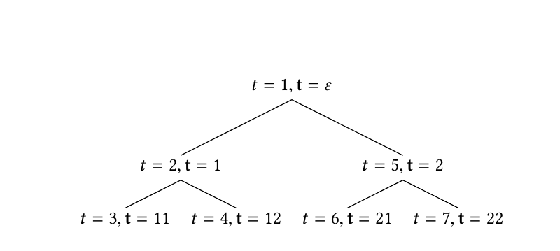

# Pixel: Forward secure Multi-signatures

1. Based on the paper [Pixel: Multi-signatures for Consensus](https://eprint.iacr.org/2019/514) 
2. Using [Apache Milagro](https://github.com/milagro-crypto/amcl).
3. Contains the simple key update and fast forward update mechanism. 

## Overview
Forward security is achieved by dividing time into periods and each time period has an associated signing key. 
Only signing keys of current time period and any necessary subsequent time periods are kept.  
Signing keys are organized as nodes (both internal and leaves) of a full binary tree with the height of the tree being logarithimic to the maximum time period. 
So for supporting `T` time periods, a tree of depth `d` is created since the total number of nodes in this tree will be 2`d+1` - 1. In the paper as well as in code, `d+1` is denoted by `l`.
The tree is then traversed in pre-order manner and nodes are assigned number numbers corresponding to time periods. In the beginning, signing key is generated for the root as time passes, 
signing key for children is generated by using any parent (immediate or grandparent) and keys for nodes earlier than the current time are removed.

     

Above is an example to support 7 time periods so `T` = 7. Each node is given a number denoted by `t` in regular font. The **`t`** in bold corresponds to the path from root to node 
where a 1 is appended if node is on left of parent otherwise a 2 is appended. In beginning, key for `t` = 1 (root) is generated. When time passes 
to `t` = 2, keys for node `t` = 2 is generated using the key for t=1 (root). Now key for t=1 needs to be removed. But it cannot be removed as only 
it can generate the key for node t=5 as t=5 has only 1 parent which is t=1. So key for t=5 is generated and then node for t=1 is removed. 
In code, the t=2 and t=5 are called successors of node for t=1. 
When t=3, key for nodes t=3 and t=4 are generated and node for t=2 is removed. And so on.

Another example to support 15 time periods so `T` = 15. Each node is given a number corresponding to the time period. In beginning key for node 1 (root) is generated.
Then when t=2, keys for node 2 and 9 are generated and node 1 is removed. When t=3, key for node 2 is removed but only after generating keys for node 3 and 6. 
When t=4, keys for node 4 and 5 are generated since their parent node 3 needs to be removed.

## API
1. There is a `Sigkey` object denoting the signing key for a time period. A signer needs to maintain a bunch of signing keys. 
2. That is done through the `SigkeySet` object. `SigkeySet` is stateful and keeps the signing keys and the current time period as well. 
   It has methods to update time by 1 or a fast forward update to any arbitrary time in future.
   - To advance to next time period, call `simple_update`. 
   - To advance to any arbitrary time i future, call `fast_forward_update`. 
   - To get current key call `get_current_key`.    
3. Call the `setup` function to create the generators, verification key, `SigkeySet` with key for t=1 and the proof of possession.
4. Call `Keypair::verify_pop` to verify proof of possession. 
5. Call `Signature::new` to generate a signature on a message.
6. Call `Signature::verify` to verify a signature.
7. Call `AggregatedVerkey::new` to aggregate verkeys.
8. Call `AggregatedSignature::new` to aggregate signatures.
